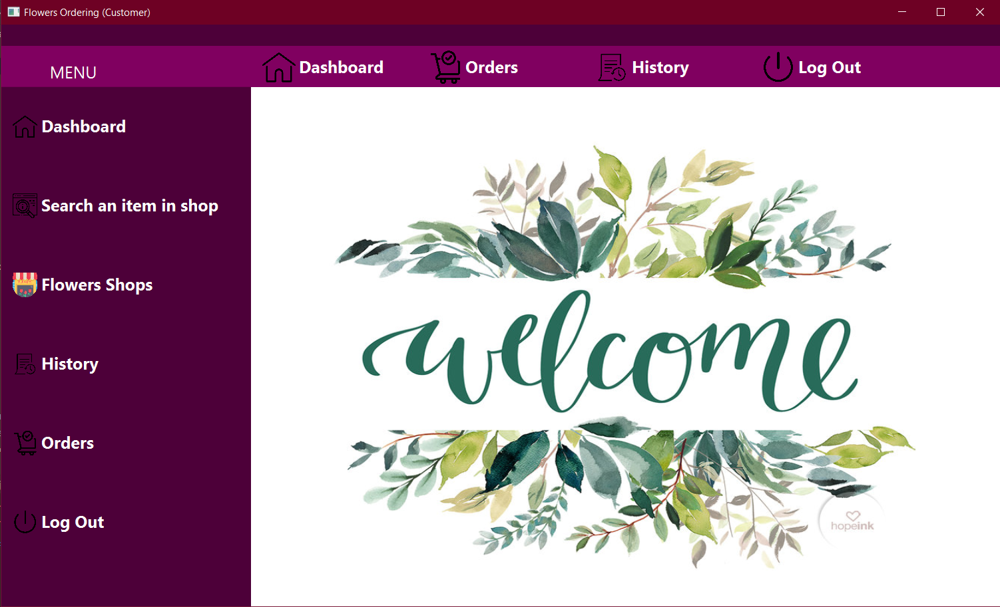

# Flowers Ordering


## General Description
The purpose of this application is to help a customer choose both the desired flower shop and the most suitable flower arrangement from a variety of models.

## Technologies Used

* [Java 17](https://www.oracle.com/java/technologies/javase-downloads.html)
* [JavaFx](https://openjfx.io/openjfx-docs/) (GUI)
* [Maven](https://maven.apache.org/) (Build Tools)
* [Nitrite Java](https://www.dizitart.org/nitrite-database.html) (DataBase)

## Setup & Run

### Clone the repository
Clone the repository using:
```git
git clone https://github.com/DenisaFleancu26/FlowersOrdering
```

### Verify that the project Builds locally
Open a command line, cd into the project and then type:
```
mvn clean install
```

### Open in IntelliJ IDEA
You can use IntelliJ and import the project as a Maven project.
### Run the project with Maven
The project has already been setup for Maven according to the above link.
To start and run the project use one of the following commands:
* `mvn javafx:run` or `./mvnw javafx:run` (run the `run` goal of the `javafx` maven plugin)

## Functionality
A user, **customer** or **manager**, can log in, reset password or create an account if they don't already have one.

   

### Customer:

A customer can navigate to the home page where he will see all the functionality: 
* search an item in shop 
* see the list with all the flower shops
* see the status of the order(approved/rejected) and leave a feedback to the manager
* see the history of all orders
* he can log out on this account.   



### Manager:

A manager can navigate to the home page where he will see all the functionality:
* he can approve or reject an order
* see the history of all orders and the customer feedback 
* he can edit items: add or delete one
* he can log out on this account.


#### Nitrite Java
Nitrite Java was used in the [UserService.java](https://github.com/DenisaFleancu26/FlowersOrdering/blob/main/src/main/java/org/loose/fis/sre/services/UserService.java), [ItemsService.java](https://github.com/DenisaFleancu26/FlowersOrdering/blob/main/src/main/java/org/loose/fis/sre/services/ItemsService.java), [UserManagerService.java](https://github.com/DenisaFleancu26/FlowersOrdering/blob/main/src/main/java/org/loose/fis/sre/services/UserManagerService.java) file, where we initialized 5 database:
* Flowers-Ordering
* Flowers-OrderingItems
* Flowers-OrderingItemsChart
* Flowers-OrderingItemsHistory
* Flowers-OrderingManager

```java
     private static ObjectRepository<User> userRepository;

public static void initDatabase(){
        Nitrite database=Nitrite.builder()
        .filePath(getPathToFile("Flowers-Ordering.db").toFile())
        .openOrCreate("Flower13","Blummen");

        userRepository=database.getRepository(User.class);
        }
```


